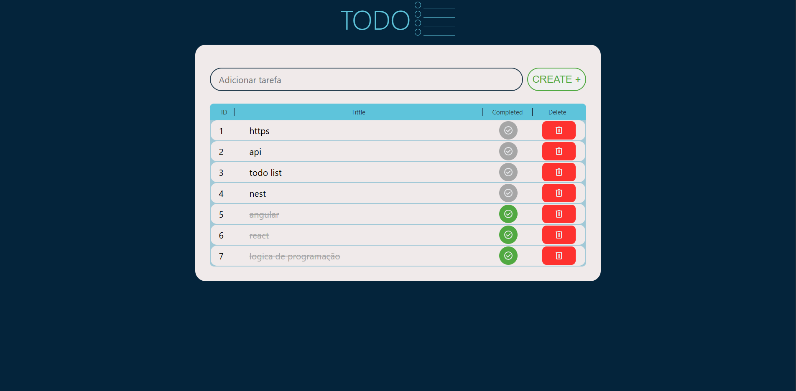

# Lista TO-DO

Uma aplicação de lista TODO simples, desenvolvida com HTML, CSS e JavaScript, que permite criar, gerenciar e excluir tarefas de maneira intuitiva.</p>

## 📌 Funcionalidades

<li>Adicionar tarefas: Crie novas tarefas para manter o controle das atividades.</li>
<li>Marcar como concluída: Marque as tarefas concluídas para melhor organização.</li>
<li>Excluir tarefas: Remova tarefas desnecessárias ou concluídas.</li>

## Tecnologias Utilizadas 🚀

<li>HTML: Estrutura do aplicativo.</li>
<li>CSS: Estilização para um design amigável e responsivo.</li>
<li>JavaScript: Funcionalidade para manipulação de tarefas.</li>

## 🎨 Captura de tela



## Como Usar

1.Clone o repositório.

```sh
git clone https://github.com/AkiroSetonai/TODO-List.git
```

2. acesse a pasta do projeto:

```sh
 cd TODO-list
```

<h2>Contribuições</h2>
Sinta-se à vontade para abrir issues e enviar pull requests para melhorias ou novas funcionalidades!
